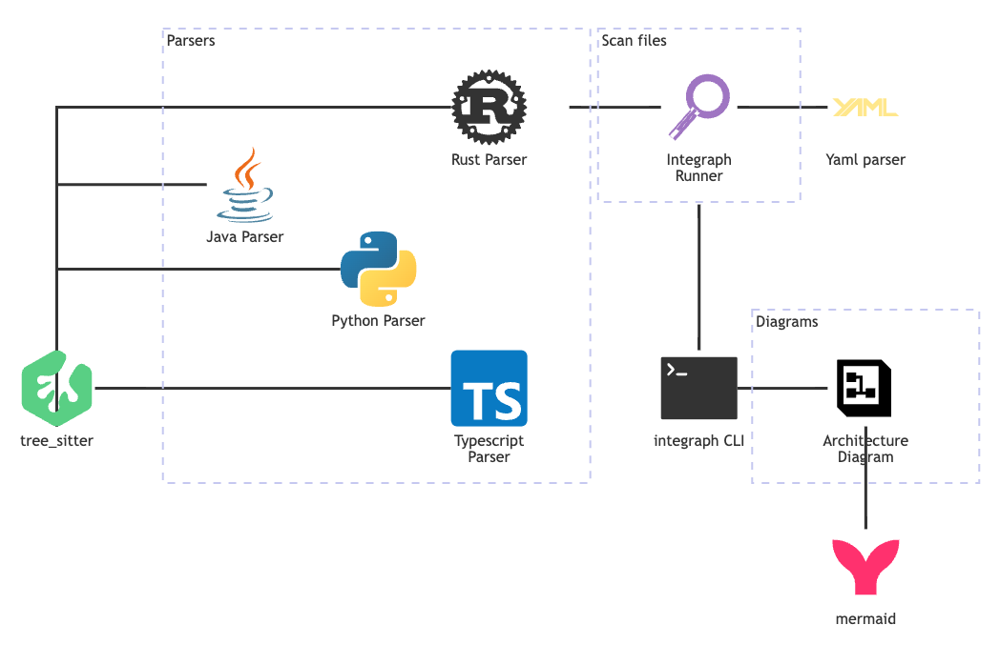
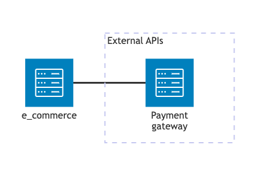
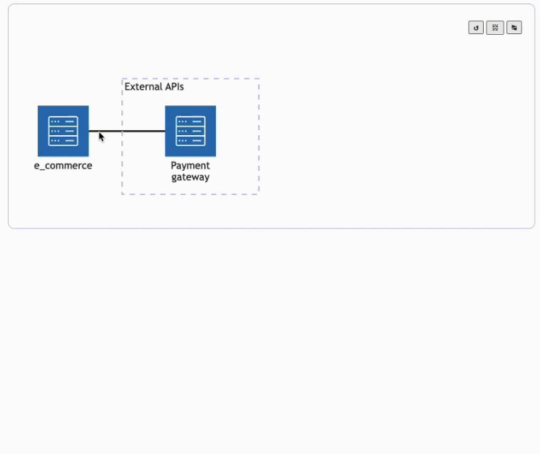

# Integraph
> Create Architecture diagrams from your code.

## Architecture



## Install

```
npm install -g integraph
```

## Usage

Map integrations adding `@integraph` comments in your source code:

```js
class ECommerce {
    /**
     * @integraph
     * service: e-commerce
     * integrations:
     *   - service: Payment gateway
     *     edgeDirection: RL
     *     group: External APIs
     */
    processsPayment() {
        // ...
    }
}

```

Under your project root directory/repository, run the following command:

```
integraph
```

The generated diagram:



It will search for files containing `@integraph` comments and mapping all integrations, and as results it generates the following files under the directory `.integraph`:

- `diagram.js`
    - it contains the function `getDiagram` which returns the `mermaid` architeture diagram.
    ```
    architecture-beta
        group externalapis[External APIs]

        service ecommerce(server)[e_commerce]
        service paymentgateway(server)[Payment gateway] in externalapis

        ecommerce:R -[ecommerce__paymentgateway]- L:paymentgateway
    ```
- `integrations.js`
    - it contains the funciton `getIntegrations` which returns a json with all mappend integrations.
    ```json
    [
        {
            "startPosition":{
                "row":1,
                "column":4
            },
            "endPosition":{
                "row":8,
                "column":7
            },
            "yaml":{
                "service":"e-commerce",
                "integrations":[
                    {
                    "service":"Payment gateway",
                    "edgeDirection":"RL",
                    "group":"External APIs"
                    }
                ]
            },
            "path":"diagrams/__tests__/fixtures/example_01.ts",
            "repo":"https://github.com/danilosampaio/integraph/blob/main",
            "sourceCode":"class ECommerce { ..."
        }
    ]
    ```
- `arch.html`
    - a html page containing the diagram and a few actions such as `refresh`, `show diagram source`, and `show integrations json`
    
- `main.css`
    - this is the css styles for the page `arch.html`
- `main.js`
    - this is the main `js` file which initialize mermaid library, render the diagram, etc.


# Mermaid Architecture Diagram

https://mermaid.js.org/syntax/architecture.html


## Take a look at the available icons

https://icon-sets.iconify.design/logos/

## Registered icons:

https://unpkg.com/@iconify-json/logos@1/icons.json

https://unpkg.com/@iconify-json/ix@1.2.0/icons.json

https://unpkg.com/@iconify-json/vscode-icons@1.2.3/icons.json
